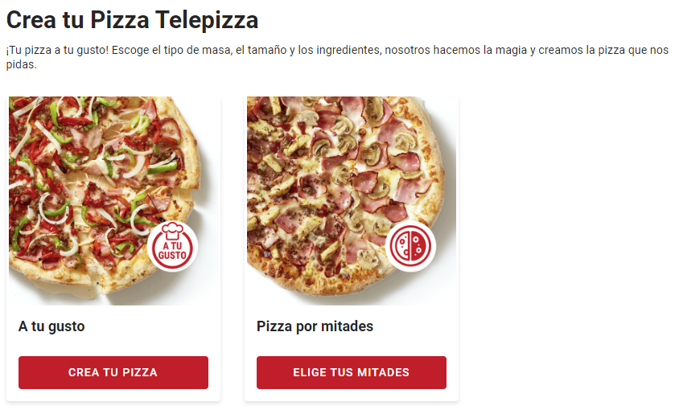
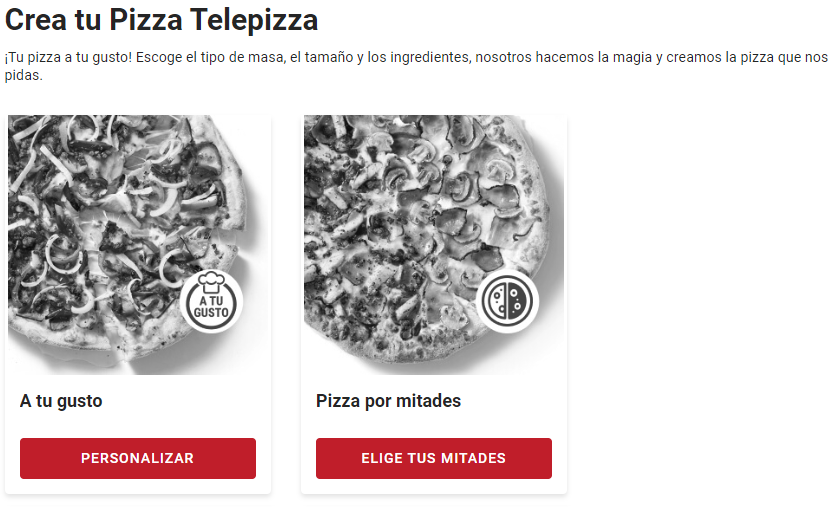
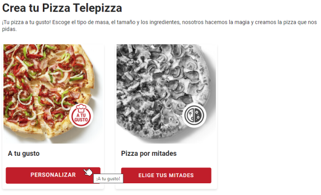

# Prueba con mutationObserver

## Misión

Utilizando JavaScript, CSS, HTML, deberás modificar el texto del botón, de la card de la pizza “A tu gusto”. La misma se encuentra [aquí](https://www.telepizza.es/comida-a-domicilio/pizzas).
La sección es dinámica, por lo que tienes que tener cuidado de que el cambio no se pierda, por ejemplo, cuando el cliente se localice en una tienda.

## Herramientas

- [DOM Reference](https://developer.mozilla.org/en-US/docs/Web/API/Document_Object_Model/Introduction)
- [AddEventListener](https://developer.mozilla.org/en-US/docs/Web/API/EventTarget/addEventListener)
- [MutationObserver](https://developer.mozilla.org/en-US/docs/Web/API/MutationObserver)
- [Code Injector](https://github.com/Lor-Saba/Code-Injector) (Extensión para el navegador)

## Resultado

### Screenshot del estado original

### Screenshot del estado modificado

### Screenshot del estado modificado haciendo hover sobre el botón

